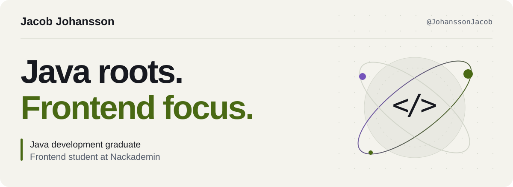
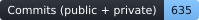
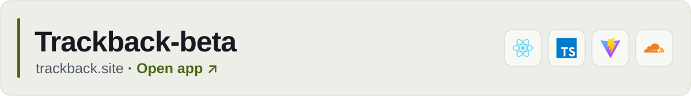
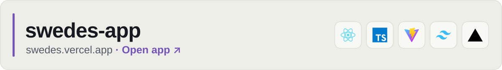
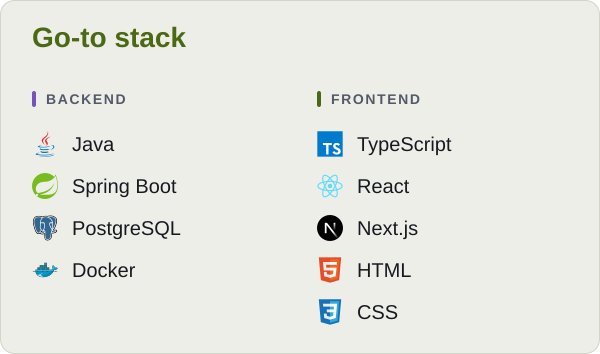
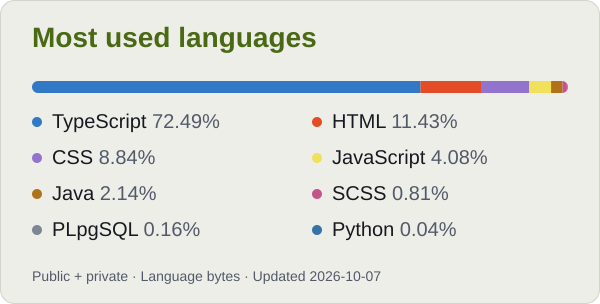

<picture>
  <source media="(prefers-color-scheme: dark)" srcset="assets/header-dark.svg">
  <source media="(prefers-color-scheme: light)" srcset="assets/header-light.svg">
  
</picture>

  Developer with professional experience from Sharpness, building web systems from APIs and CI pipelines to the interface. 
  Now I'm studying frontend development at Nackademin and shipping my own React apps along the way.

  <a href="mailto:jacobaxeljohansson@gmail.com"><strong>Email me ↗</strong></a>
  &nbsp;·&nbsp;
  <a href="https://github.com/JohanssonJacob?tab=repositories"><strong>All repositories ↗</strong></a>

  
  
  

## Featured projects

<a href="https://trackback.site/">
<picture>
  <source media="(prefers-color-scheme: dark)" srcset="assets/trackback-dark.svg">
  <source media="(prefers-color-scheme: light)" srcset="assets/trackback-light.svg">
  
</picture>
</a>

A collection of music games in the browser: guess the release year, the song and the artist. Play solo or in multiplayer, and add friends to challenge them. 
React · TypeScript · Vite · Cloudflare Workers

<a href="https://swedes.vercel.app/">
<picture>
  <source media="(prefers-color-scheme: dark)" srcset="assets/swedes-dark.svg">
  <source media="(prefers-color-scheme: light)" srcset="assets/swedes-light.svg">
  
</picture>
</a>

A hub for the Swedes Old School RuneScape clan, featuring bingo, boss events, and member tracking. 
React · TypeScript · Vite · Tailwind CSS · Vercel

## Experience

**Hasses Solskydd** · via Sharpness 
JAVA BACKEND & REACT FRONTEND · SEP 2023 – MAY 2024

Worked in a four-person development team on a web-based case and order management system. My main responsibilities included defining APIs, setting up continuous integration, and developing the backend, alongside some frontend work with the team.

`Java` `Spring Boot` `MyBatis` `PostgreSQL` `Next.js` `React`

**Signup (open source)** · via Sharpness 
JAVA BACKEND & ANGULAR FRONTEND · OCT 2022 – SEP 2023

Contributed to modernizing a registration system from Scala to Java and Spring Boot, alongside updates to its interface and user flows. My involvement spanned requirements review, architecture, development, testing, version control, and releases.

`Java` `Spring Boot` `MyBatis` `PostgreSQL` `Angular` `Google Cloud Run & Cloud SQL`

## Education

- **Frontend Development** · Nackademin — currently studying
- **Java Development** · Nackademin — graduated 2023
- **Accelerated Development Program** · Sharpness

## Tools & languages

<picture>
  <source media="(prefers-color-scheme: dark)" srcset="assets/stack-dark.svg">
  <source media="(prefers-color-scheme: light)" srcset="assets/stack-light.svg">
  
</picture>

<picture>
  <source media="(prefers-color-scheme: dark)" srcset="assets/languages-dark.svg">
  <source media="(prefers-color-scheme: light)" srcset="assets/languages-light.svg">
  
</picture>
